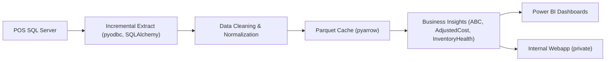

# Retail POS Data Analytics Pipeline

End-to-end automation that turns raw POS SQL data into decision-ready BI insights (ABC classification, margin correction, and inventory health) for mid-size retail.

以端到端自動化流程，將 POS SQL 原始數據轉化為可決策的 BI 洞察（ABC 分級、毛利校正、庫存健康），適用於中型零售業。

## Project Overview / 專案概述

This project builds a repeatable data pipeline to replace manual reporting, fix profit distortion caused by misc barcodes, and surface inventory risks through clear, actionable metrics.

本專案打造可重複執行的資料管道，取代人工報表作業，修正萬用條碼造成的利潤失真，並用清楚可行動的指標呈現庫存風險。

## Problem & Context / 問題與背景

- **Data silos and manual reporting**: POS exports were fragmented, slow, and hard to reconcile.
- **Profit distortion from misc barcodes**: Many items had zero cost, making margin and ABC analysis unreliable.
- **Inventory blind spots**: No systematic way to detect low-stock risk or dead stock.

- **資料孤島與人工報表**：POS 匯出分散、耗時且難以整合。
- **萬用條碼成本為 0 的獲利失真**：毛利與 ABC 分析不可靠。
- **庫存盲區**：缺乏系統化的低庫存與滯銷偵測。

## Solution Highlights / 解法亮點

- **Incremental ETL**: Cache sales data with parquet to reduce DB load and speed up refresh.
- **Data cleansing**: Normalize newline/whitespace issues from POS exports.
- **AdjustedCost logic**: Estimate conservative cost for misc items to stabilize margin analytics.
- **ABC classification**: Rank products by profit contribution for procurement decisions.
- **Inventory health**: Track days of inventory to flag low stock and dead stock.

- **增量 ETL**：使用 parquet 快取降低資料庫壓力並加速更新。
- **資料清洗**：修正 POS 匯出常見的換行/空白問題。
- **成本校正邏輯**：對雜項估算保守成本以穩定毛利分析。
- **ABC 分級**：依利潤貢獻排序商品，協助採購。
- **庫存健康指標**：以庫存支撐天數標記低庫存與滯銷。

## Impact (Qualitative + Template) / 影響（質化 + 可補量化模板）

- **Report refresh latency**: `TBD` (e.g., from X hours to Y minutes).
- **Manual reporting effort**: `TBD` (e.g., hours/week saved).
- **Margin accuracy for misc items**: `TBD` (e.g., reduced distortion of gross profit).
- **Inventory risk visibility**: `TBD` (e.g., alerts for low stock/dead stock).

- **報表更新時間**：`TBD`（例如從 X 小時降至 Y 分鐘）。
- **人工報表工時**：`TBD`（例如每週節省 X 小時）。
- **雜項毛利準確度**：`TBD`（例如降低毛利失真程度）。
- **庫存風險可視性**：`TBD`（例如低庫存/滯銷預警）。

## Architecture & Data Flow / 架構與資料流程



## Tech Stack / 技術棧

- **Language**: Python 3.9+
- **Data**: Pandas, NumPy, PyArrow
- **Database**: SQLAlchemy, SQL Server (pyodbc)
- **BI**: Power BI
- **Env**: Conda, python-dotenv

## How to Run (Dev) / 執行方式

Clone:
```
git clone https://github.com/chengchakkwong/POS-Data-Analytics-Pipeline.git
```

Create environment:
```
conda env create -f environment.yml
conda activate <env-name>
```

Run:
```
python pos_system_v2.py
```

## Configuration / 設定

Create a `.env` file in the project root:
```
DB_DRIVER={ODBC Driver 17 for SQL Server}
DB_SERVER=your_server
DB_DATABASE=your_database
DB_UID=your_username
DB_PWD=your_password
DB_TRUST_CERT=yes
```

## Project Structure / 檔案結構

- `pos_system_v2.py`: Orchestrates sync + analytics pipeline.
- `pos_service.py`: SQL Server integration and incremental sync.
- `business_insights.py`: Core analytics (ABC, AdjustedCost, inventory health).
- `db_utils.py`: DB connection and environment handling.
- `environment.yml`: Reproducible dev environment.

## Privacy & Data Handling / 隱私與資料處理

The internal webapp is private. A sanitized demo is in progress and will be shared when ready.

內部 webapp 為公司內部系統，正在準備脫敏版本以供展示。

## Contact / 聯絡方式

ChakKwong (Cheng Chak Kwong)  
chengchakkwong@gmail.com
📦 零售 POS 數據自動化分析與 BI 管道

Retail POS Data Automation & Business Intelligence Pipeline

📖 專案背景

在本專案中，我針對中型零售店（五金家品類）開發了一套全自動化的數據處理流程。該專案解決了傳統零售業常見的挑戰：數據孤島、手工報表耗時、以及萬用條碼（如雜項、五金件）導致的獲利分析失真。

透過 Python 進行 ETL（擷取、轉換、加載），並連接 Power BI 進行視覺化，實現了從原始 SQL 數據到商業決策洞察的閉環。

🚀 核心功能與商業邏輯

1. 高效數據同步 (ETL)

增量同步：利用 pyarrow 與 parquet 格式建立銷售快取，僅抓取變動數據，大幅減少資料庫壓力與讀取時間。

源頭清洗：自動修正 POS 系統匯出時常見的換行符 (\n, \r) 與空白字符導致的格式錯亂。

2. 精準商業洞察 (Business Insights)

ABC 產品分級：基於利潤貢獻度（Pareto Principle）自動將數千種商品劃分為 A、B、C 三類，輔助採購決策。

雜項成本估算邏輯：

挑戰：店內「五金雜項」使用萬用條碼 202320232023，系統中常無進貨成本（成本為 0），導致利潤虛高。

對策：自定義 AdjustedCost 邏輯，針對雜項自動回推 80% 保守成本（即預設 20% 毛利），確保 ABC 分析的真實性。

庫存健康監控：計算日均銷量與支撐天數（Days of Inventory），自動標記「低庫存預警」與「滯銷死貨」。

📁 檔案結構

pos_system_v2.py: 系統主入口，統籌數據同步與分析流程。

pos_service.py: 負責與 SQL Server 對接及數據增量同步邏輯。

business_insights.py: 核心商業邏輯模組，包含 ABC 分級與成本修正函式。

db_utils.py: 資料庫連線與環境變數管理封裝。

environment.yml: 專案環境設定檔，方便一鍵還原開發環境。

🛠️ 技術棧 (Tech Stack)

語言: Python 3.9+

數據處理: Pandas, NumPy, PyArrow

資料庫管理: SQLAlchemy, SQL Server (pyodbc)

視覺化: Power BI (Pareto Charts, Scatter Matrix, Slicers)

環境管理: Conda, Python-Dotenv

⚙️ 如何執行

複製專案:

git clone [https://github.com/chengchakkwong/POS-Data-Analytics-Pipeline.git](https://github.com/chengchakkwong/POS-Data-Analytics-Pipeline.git)


建立環境:

conda env create -f environment.yml
conda activate [your_env_name]


設定環境變數:
在根目錄建立 .env 檔案並填入你的資料庫連線資訊。

運行分析:

python pos_system_v2.py


🔒 隱私與安全聲明

為了保護商業機密，本專案：

已透過 .gitignore 排除所有真實交易數據 (data/)。

敏感連線資訊透過 .env 進行管理，不進入版本控制。

提供的程式碼範例已進行數據脫敏處理。

專案開發者: ChakKwong (Cheng Chak Kwong)

聯繫方式: chengchakkwong@gmail.com