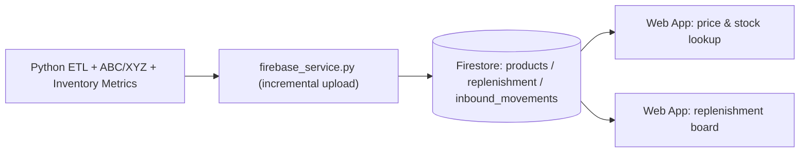

# Retail POS Data Analytics Pipeline

End-to-end Python pipeline that turns POS SQL data into decision-ready analytics: ABC/XYZ classification, margin correction, and target-stock planning for retail operations.

以端到端 Python 資料管道，將 POS SQL 原始數據轉化為可決策的分析指標：ABC/XYZ 分級、毛利校正及目標庫存規劃，支援零售營運。

**Portfolio focus / 作品定位**：Data Analyst · Junior Data Engineer · Analytics Engineer — repeatable ETL, metric design, and reproducible offline demo.

## Screenshots / Demo 預覽

| Demo terminal output | Analysis output preview |
|----------------------|-------------------------|
|  |  |

1. `python demo_pipeline.py` terminal summary (`ABC_Class` / `XYZ_Class` counts).
2. Filtered preview from `demo_output/abc_xyz_analysis.csv` (table or a simple ABC/XYZ chart from sample data).

## Problem & Context / 問題與背景

- **Data silos and manual reporting**: POS data was fragmented across exports and difficult to reconcile.
- **Margin distortion from generic-barcode items**: Missing or unreliable recorded costs could distort margin and ABC analysis.
- **Inventory planning gap**: Replenishment review lacked systematic demand and target-stock signals.

- **資料孤島與人工報表**：POS 資料分散於不同匯出檔，整合與核對困難。
- **萬用條碼的毛利失真**：成本缺失或不可靠時，會扭曲毛利與 ABC 分析。
- **庫存規劃缺口**：補貨覆核缺乏系統化的需求與目標庫存訊號。

## Solution Highlights / 解法亮點

- **Incremental ETL**: Cache sales data with partitioned Parquet and refresh only affected monthly partitions.
- **Data cleansing**: Normalize newline/whitespace issues in POS source fields.
- **AdjustedCost logic**: Estimate conservative cost for misc items to stabilize margin analytics.
- **ABC / XYZ classification**: Rank products by profit contribution and demand variability; attach strategy labels.
- **Hybrid target-stock planning**: The v3 analytics module forecasts next-month demand for data-sufficient AX/AY/BX/BY SKUs with Prophet by default (NeuralProphet remains an optional experimental backend). Other products use interpretable run-rate, recent complete-month averages, Z-class defensive rules, and C-class ordering heuristics. The web app calculates manager-reviewed suggested orders from `Target_Stock`, on-hand inventory, and order constraints.

- **增量 ETL**：使用分區 Parquet 快取，並只更新受影響的月份分區。
- **資料清洗**：修正 POS 來源欄位常見的換行／空白問題。
- **成本校正邏輯**：對雜項估算保守成本以穩定毛利分析。
- **ABC / XYZ 分級**：依利潤貢獻與需求波動分類，並產出策略標籤。
- **混合式目標庫存規劃**：v3 analytics 對資料足夠的 AX／AY／BX／BY 預設使用 Prophet（NeuralProphet 僅作實驗後端）。其他商品採可解釋的 run-rate、完整近月平均、Z 類防禦規則與 C 類訂貨規則。Web App 再依 `Target_Stock`、現有庫存及起訂／倍數規則計算供管理者覆核的建議訂購量。

## Impact / 影響

**Context / 背景**：Single-store pilot · 5-person store team · 7,289 SKUs in the replenishment-data snapshot (2026-04-19 to 2026-07-13) · 單店試行 · 5 人店舖團隊 · 試行快照中的補貨資料涵蓋 7,289 個 SKU（2026-04-19 至 2026-07-13）

- **Prior workflow**: Staff used the POS back office and SQL-to-Excel extracts to review stock and estimate reorder quantities from on-hand stock and latest inbound quantity.
- **Delivered decision support**: The pipeline produces ABC/XYZ labels, strategy labels, and demand-based `Target_Stock` for an internal web app. Managers retain final ordering decisions and can override must-stock exceptions.

- **原有流程**：店員以 POS 後台及 SQL 匯出 Excel 檢視庫存，按現貨量與最近入貨量估計補貨數量。
- **交付的決策支援**：管道產出 ABC/XYZ、策略標籤與需求導向的 `Target_Stock`，供內部 Web App 使用；最終訂貨仍由管理者判斷，必備商品等例外可人工覆核。

- **Pipeline**: Incremental Parquet sync → metrics → Firestore → web app.
- **Misc barcodes**: `AdjustedCost` logic for generic-barcode SKUs in [`abc_xyz_analysis.py`](abc_xyz_analysis.py).
- **Inventory signals**: Strategy labels (e.g. `CZ` for potential retirement review); replenishment board compares `Target_Stock` with on-hand stock.

- **管道**：增量 Parquet → 指標 → Firestore → Web App。
- **萬用條碼**：[`abc_xyz_analysis.py`](abc_xyz_analysis.py) 內 `AdjustedCost` 校正邏輯。
- **庫存信號**：策略標籤（如 `CZ` 考慮汰換檢視）；補貨看板比較 `Target_Stock` 與現有庫存。

## Pilot Evaluation / 試行評估

The following **system-record KPIs** were calculated from a local, de-identified Firestore snapshot using [`scripts/evaluate_pilot.py`](scripts/evaluate_pilot.py). Production data and the snapshot remain private; only approved aggregates are published here.

下列**系統紀錄 KPI**由本機去識別化 Firestore snapshot，以 [`scripts/evaluate_pilot.py`](scripts/evaluate_pilot.py) 計算。正式資料與 snapshot 均維持私有；本頁只公開已核准的彙總結果。

**Observation window / 觀測期間**：2026-04-19 to 2026-07-13 · Single-store pilot / 單店試行

| Metric / 指標 | Result / 結果 | Interpretation / 解讀 |
| --- | ---: | --- |
| Replenishment SKUs / 補貨資料 SKU | 7,289 | Current replenishment-data snapshot / 當時補貨資料快照 |
| ABC/XYZ coverage / 分級覆蓋率 | 97.5% (7,109 / 7,289) | SKU with both classification fields / 同時具備兩個分級欄位 |
| Target-stock coverage / 目標庫存覆蓋率 | 97.4% (7,102 / 7,289) | SKU with a target-stock value / 具備目標庫存數值 |
| Replenishment candidates / 補貨候選 SKU | 2,149 (29.5%) | `Target_Stock` exceeds usable on-hand stock; requires manager review / 需管理者覆核的候選清單，非自動下單 |
| Arrival records / 到貨紀錄 | 392 | Structured arrival entries during the window / 觀測期內的結構化到貨紀錄 |
| Distinct operators / 不同操作人 | 4 | Based on de-identified operator names recorded in arrival entries / 依到貨紀錄中的去識別化操作人名稱統計 |
**Evidence boundaries / 證據界線**：

- Coverage metrics show data readiness, not classification or forecast accuracy.（覆蓋率反映資料準備程度，不等於分類或預測準確率。）
- Target-stock values demonstrate data availability in the snapshot only, not how they were calculated. Per-SKU generation source, model/version, and run timestamp were not retained; the pilot therefore does not establish Prophet/NeuralProphet use or forecast accuracy.（目標庫存數值僅反映快照中資料可用，不代表其計算方式。由於未保存逐 SKU 的生成來源、模型／版本及執行時間，試行結果不作 Prophet／NeuralProphet 已使用或預測準確度的宣稱。）
- Candidates are a prioritised review list; store staff retain final ordering decisions.（候選項目是優先覆核清單，最終訂貨仍由店員／管理者判斷。）
- The current system does not persist lookup time, scan-success rate, daily active users, or final purchase-order quantities; these are not claimed as outcomes.（目前未保存查貨耗時、掃碼成功率、日活躍使用者或最終下單量，因此不以此宣稱成效。）
- Inbound-match and issue-closure rates are withheld pending one-to-one reconciliation validation and test-record exclusion.（入貨核對與回報結案率待完成一對一核對驗證及測試資料排除後才公開。）

Full methodology: [`docs/PILOT_EVALUATION.md`](docs/PILOT_EVALUATION.md)

## Architecture & Data Flow / 架構與資料流程


```mermaid
flowchart LR
  PosDB["POS SQL Server"]
  Extract["Incremental Extract"]
  Cache["Parquet Cache"]
  Labels["ABC / XYZ Labels"]
  Plan["Target Stock Plan + Trace"]
  PosDB --> Extract --> Cache --> Labels --> Plan
```

v3 analytics detail (complete-month calendar, model gates, failure policy): [`docs/ANALYTICS_PIPELINE.md`](docs/ANALYTICS_PIPELINE.md)

**Current outputs / 目前產出**：`data/insights/abc_xyz_analysis.csv`, `target_stock_plan.csv`, `target_stock_trace.csv` (production) or `demo_output/` (offline ABC/XYZ demo).  

## Result Delivery / 成果落地

The pipeline does not stop at CSV files. In production, computed metrics are incrementally written to **Firestore** and consumed by an internal web app for price/stock lookup and replenishment workflows.

分析結果不止於 CSV。正式環境中，計算出的指標會**增量寫入 Firestore**，並由內部 Web App 直接使用，支援查價、查庫存與補貨工作流程。


```mermaid
flowchart LR
  ETL["Python ETL + ABC/XYZ + Inventory Metrics"] --> Upload["firebase_service.py (incremental upload)"]
  Upload --> FS[("Firestore: products / replenishment / inbound_movements")]
  FS --> Scan["Web App: price & stock lookup"]
  FS --> Repl["Web App: replenishment board"]
```

**How results are delivered / 結果如何交付**：

- **`products`** — stock master, price/quantity, and ABC/XYZ labels → web app price & stock lookup.（商品主檔、價格／庫存及 ABC/XYZ 標籤，供查價／查庫存）
- **`replenishment`** — target stock, order rules, and ABC/XYZ labels → replenishment suggestions.（目標庫存、補貨規則及 ABC/XYZ 標籤）
- **`inbound_movements`** — inbound records → admin arrival verification.（入貨單據，後台到貨核對）

**Engineering notes / 工程設計**：uploads use per-record MD5 hashing to skip unchanged documents (saving write quota) and Firestore batch writes for throughput. See [`firebase_service.py`](firebase_service.py).  
上傳採用單筆 MD5 指紋比對，跳過未變動文件以節省寫入額度，並用 Firestore batch 批次寫入。

### Screenshots / 截圖

| Replenishment board | Price & stock lookup |
|---------------------|----------------------|
|  |  |

Downstream web app: the public, portfolio-safe [Retail Barcode Stock & Replenishment Web App](https://github.com/chengchakkwong/retail-operations-web-app) shows the staff and admin workflows that consume this pipeline's Firestore data. The production operational implementation remains private.

下游 Web App：公開、適合作品集檢視的 [Retail Barcode Stock & Replenishment Web App](https://github.com/chengchakkwong/retail-operations-web-app) 展示店員與管理端如何使用本 Pipeline 寫入 Firestore 的資料；正式營運實作則維持私有。

## Related Applications / 相關應用

This repository is the public analytics and data-delivery component of a retail operations system:

- **This repository — `POS-Data-Analytics-Pipeline`**: extracts POS data, computes analytics and replenishment signals, and incrementally syncs the resulting records to Firestore.
- **[Retail Barcode Stock & Replenishment Web App](https://github.com/chengchakkwong/retail-operations-web-app)**: public, portfolio-safe source release that presents the downstream staff and admin workflows.
- **Private operational app**: contains operation-specific implementation details and is intentionally not linked or published. Production credentials and real store data are excluded from all repositories.

本 repository 是零售營運系統中公開的分析與資料交付部分：Pipeline 負責抽取、分析、同步；公開 Web App 展示下游操作流程；正式營運 App 則因營運細節維持私有。

## Offline Demo (no SQL Server) / 離線 Demo（不需 SQL Server）

Reviewers can run the core analytics end-to-end without production database access.

於 `sample_data/` 提供脫敏後的商品主檔與銷售資料，可在無正式資料庫環境下重現 ABC-XYZ 分析流程。

### Quick start / 快速開始

```bash
git clone https://github.com/chengchakkwong/POS-Data-Analytics-Pipeline.git
cd POS-Data-Analytics-Pipeline
python -m venv .venv
# Windows: .venv\Scripts\activate
# macOS/Linux: source .venv/bin/activate
pip install -r requirements-demo.txt
python demo_pipeline.py
```

**Output / 輸出**：

```text
demo_output/abc_xyz_analysis.csv
```

Example terminal summary (seed=42) / 終端摘要範例：

```text
=== Offline Demo Summary ===
Rows: 183

ABC class counts:
C           103
A            37
B            35
New           5
Excluded      3

XYZ class counts:
Z      138
Y       36
New      5
X        4
```

### Optional: simulate the Firestore "Load" stage / 選用：模擬 Firestore 上傳

Build the document payloads that would be written to Firestore (offline, no network), and see the incremental MD5 de-duplication in action:

離線模擬上傳到 Firestore 的文件 payload（不連網路），並觀察增量 MD5 去重：

```bash
python demo_firebase_payload.py
```

Writes `demo_output/firebase_payload/{products,classification}.json` and prints `would upload / skipped`. `classification.json` is an offline payload preview, not a separate production Firestore collection. Re-run it to see all documents skipped (unchanged).

輸出 `products.json`、`classification.json` 並印出上傳／略過統計；`classification.json` 是離線 payload 預覽，並非正式 Firestore 的獨立 collection。再跑一次會看到全部略過（未變動）。

Regenerate the sample (requires real data under `data/processed/`, local only)：

```bash
python scripts/anonymize_data.py --seed 42 --dry-run
python scripts/anonymize_data.py --seed 42
```

See [`sample_data/README.md`](sample_data/README.md) for anonymization rules and known design behaviors.  
完整脫敏規則與已知設計行為請見 [`sample_data/README.md`](sample_data/README.md)。

## Production Pipeline (SQL Server) / 正式管道（需 SQL Server）

Recommended v3 path:

```bash
pip install -r requirements.txt
pip install -e .
# Create .env with DB credentials (see Configuration below)

python -m pos_pipeline.cli daily        # Stock + Firestore sync
pip install -r requirements-forecast.txt
python -m pos_pipeline.cli analytics    # ABC/XYZ + A/B/New/C target stock
```

The v3 package is the supported analytics implementation. Legacy root sync and classification scripts remain only where migration is incomplete. Operational sequence: **[docs/使用說明.md](docs/使用說明.md)**. Analytics rules: **[docs/ANALYTICS_PIPELINE.md](docs/ANALYTICS_PIPELINE.md)**.

**內部使用**：優先 `pos_pipeline.cli`；完整順序見 **[docs/使用說明.md](docs/使用說明.md)**，分析規格見 **[docs/ANALYTICS_PIPELINE.md](docs/ANALYTICS_PIPELINE.md)**。

## Tech Stack / 技術棧

- **Language**: Python 3.11 recommended
- **Data**: Pandas, NumPy, PyArrow
- **Database**: SQLAlchemy, SQL Server (pyodbc)
- **Delivery**: Decision-ready CSV analytics and incremental Firestore document sync
- **Scheduled sync (v3)**: Cloud Build → Artifact Registry → Cloud Run Job + Cloud Scheduler（細節見 [`docs/CLOUD_RUN_DAILY.md`](docs/CLOUD_RUN_DAILY.md)）
- **Forecasting** *(optional)*: Prophet via `requirements-forecast.txt`; NeuralProphet experimental via `requirements-neuralprophet.txt`
- **Env**: python-dotenv, venv / pip

## Project Structure / 檔案結構

| Path | Role |
|------|------|
| [`demo_pipeline.py`](demo_pipeline.py) | Offline demo entry — reads `sample_data/`, writes `demo_output/` |
| [`src/pos_pipeline/`](src/pos_pipeline/) | v3 package — `cli daily` / `cli analytics` |
| [`docs/ANALYTICS_PIPELINE.md`](docs/ANALYTICS_PIPELINE.md) | v3 analytics data flow, rules, and column contract |
| [`Dockerfile.daily`](Dockerfile.daily) | Image for the scheduled daily job |
| [`docs/CLOUD_RUN_DAILY.md`](docs/CLOUD_RUN_DAILY.md) | Cloud Run / Scheduler runbook |
| [`pos_service.py`](pos_service.py) | Legacy SQL extract (still used by min-multiple) |
| [`db_utils.py`](db_utils.py) | Legacy DB helpers |
| [`deprecated/`](deprecated/) | Superseded scripts (old sync/upload, PyInstaller spec) |
| [`experiments/`](experiments/) | Non-production feature / weather experiments |
| [`scripts/anonymize_data.py`](scripts/anonymize_data.py) | Generate anonymized `sample_data/` from local processed data |
| [`sample_data/`](sample_data/) | Committed anonymized demo dataset |
| [`requirements-base.txt`](requirements-base.txt) | Shared pinned Pandas / NumPy / PyArrow stack |
| [`requirements-demo.txt`](requirements-demo.txt) | Offline demo dependencies |
| [`requirements.txt`](requirements.txt) | Production runtime dependencies |
| [`requirements-forecast.txt`](requirements-forecast.txt) | Official Prophet forecast dependencies |
| [`requirements-neuralprophet.txt`](requirements-neuralprophet.txt) | Experimental NeuralProphet stack |

## Configuration / 設定

Create a `.env` file in the project root (not committed):

```
DB_DRIVER={ODBC Driver 17 for SQL Server}
DB_SERVER=your_server
DB_DATABASE=your_database
DB_UID=your_username
DB_PWD=your_password
DB_TRUST_CERT=yes
```

Optional: `FIREBASE_KEY_PATH` overrides the default `serviceAccountKey.json` path (used by the Cloud Run job).

## Privacy & Data Handling / 隱私與資料處理

- Real transaction data under `data/` is excluded via [`.gitignore`](.gitignore).
- Credentials and secrets (`.env`, Firebase keys) are never committed.
- [`sample_data/`](sample_data/) is anonymized by [`scripts/anonymize_data.py`](scripts/anonymize_data.py): re-mapped IDs, synthetic names/barcodes, shifted dates, and perturbed prices — mappings stay in memory only.
- Internal webapp and Firebase integrations exist for production use but are not required for the public offline demo.

- 真實交易資料位於 `data/`，已由 `.gitignore` 排除。
- 連線資訊與金鑰透過 `.env` 管理，不進版本控制。
- `sample_data/` 為脫敏示範資料，可安全供 reviewer 重現分析流程。

## Contact / 聯絡方式

ChakKwong (Cheng Chak Kwong)  
chengchakkwong@gmail.com
