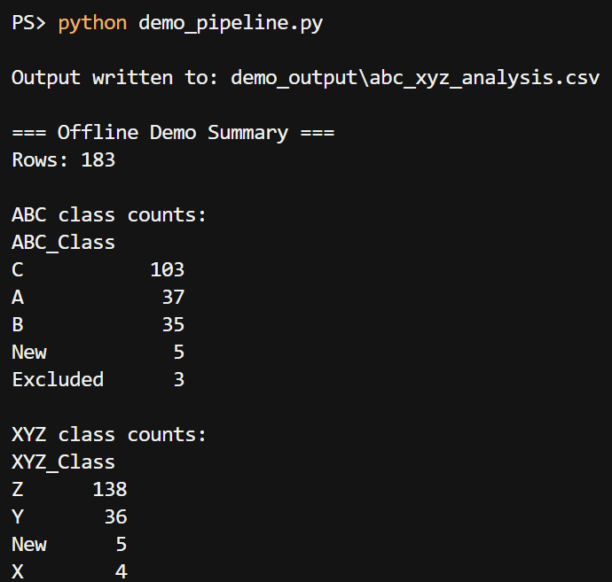
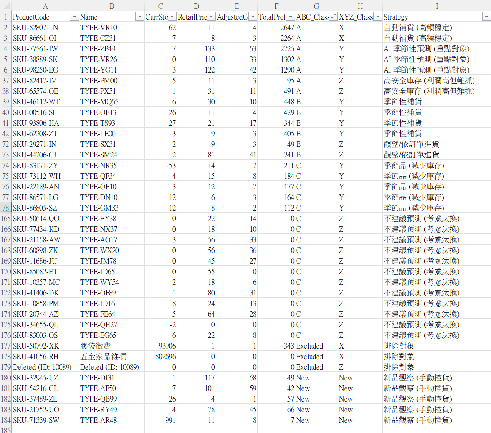
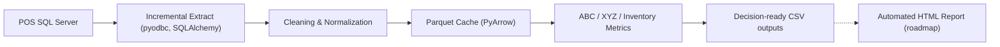
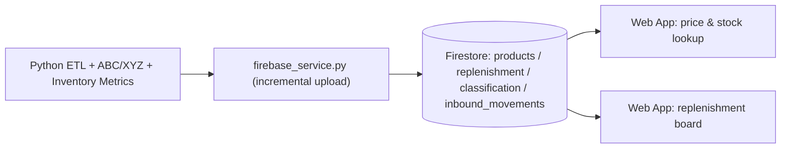
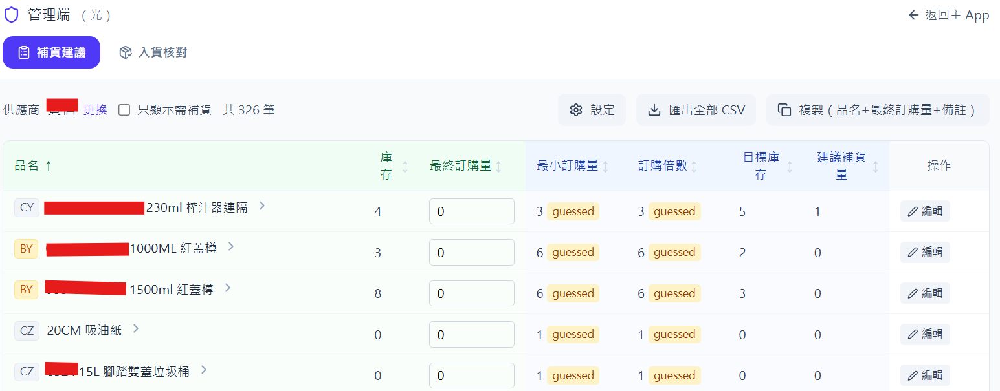
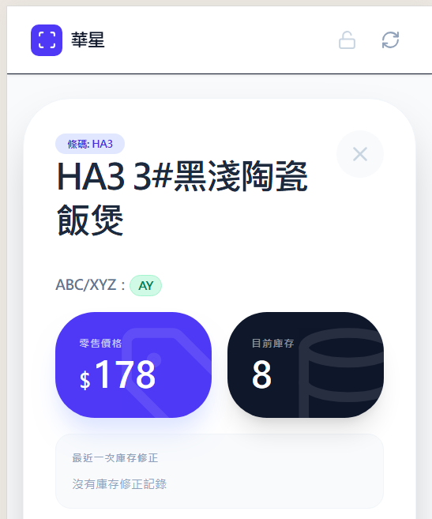

# Retail POS Data Analytics Pipeline

End-to-end Python pipeline that turns raw POS SQL data into decision-ready analytics (ABC/XYZ classification, margin correction, and inventory health) for mid-size retail.

以端到端 Python 資料管道，將 POS SQL 原始數據轉化為可決策的分析指標（ABC/XYZ 分級、毛利校正、庫存健康），適用於中型零售業。

**Portfolio focus / 作品定位**：Data Analyst · Junior Data Engineer · Analytics Engineer — repeatable ETL, metric design, and reproducible offline demo.

## Screenshots / Demo 預覽

| Demo terminal output | Analysis output preview |
|----------------------|-------------------------|
|  |  |

1. `python demo_pipeline.py` terminal summary (`ABC_Class` / `XYZ_Class` counts).
2. Filtered preview from `demo_output/abc_xyz_analysis.csv` (table or a simple ABC/XYZ chart from sample data).

## Problem & Context / 問題與背景

- **Data silos and manual reporting**: POS exports were fragmented, slow, and hard to reconcile.
- **Profit distortion from misc barcodes**: Many items had zero cost, making margin and ABC analysis unreliable.
- **Inventory blind spots**: No systematic way to detect low-stock risk or dead stock.

- **資料孤島與人工報表**：POS 匯出分散、耗時且難以整合。
- **萬用條碼成本為 0 的獲利失真**：毛利與 ABC 分析不可靠。
- **庫存盲區**：缺乏系統化的低庫存與滯銷偵測。

## Solution Highlights / 解法亮點

- **Incremental ETL**: Cache sales data with partitioned Parquet to reduce DB load and speed up refresh.
- **Data cleansing**: Normalize newline/whitespace issues from POS exports.
- **AdjustedCost logic**: Estimate conservative cost for misc items to stabilize margin analytics.
- **ABC / XYZ classification**: Rank products by profit contribution and demand variability; attach strategy labels.
- **Inventory health**: Track days of inventory and target-stock planning for replenishment decisions.

- **增量 ETL**：使用分區 Parquet 快取降低資料庫壓力並加速更新。
- **資料清洗**：修正 POS 匯出常見的換行/空白問題。
- **成本校正邏輯**：對雜項估算保守成本以穩定毛利分析。
- **ABC / XYZ 分級**：依利潤貢獻與需求波動分類，並產出策略標籤。
- **庫存健康指標**：支撐天數與目標庫存規劃，支援補貨決策。

## Impact / 影響

**Context / 背景**：Single-store pilot · ~7,800 non-barcoded SKUs · 5 staff · 單店試行 · 約 7,800 無條碼 SKU · 5 人團隊

- **Before**: No ABC/XYZ or replenishment analytics; stock via POS backend only. Staff exported SQL to Excel and estimated reorder qty per SKU from on-hand stock and last inbound qty.
- **After**: Python pipeline produces ABC/XYZ, strategy labels, and demand-based `Target_Stock`; internal web app for daily replenishment. System handles routine SKUs; staff override for must-stock exceptions (e.g. low-profit home-goods essentials).

- **改版前**：無 ABC/XYZ 與補貨分析，僅 POS 後台查庫存；SQL 匯出 Excel，逐項依庫存與上次進貨量估計補貨量。
- **改版後**：管道產出 ABC/XYZ、策略標籤與 `Target_Stock`，內部 Web App 供每日補貨；常規 SKU 由系統建議，家品必備等例外由人手把關。

- **Pipeline**: Incremental Parquet sync → metrics → Firestore → web app.
- **Misc barcodes**: `AdjustedCost` logic for generic-barcode SKUs in [`abc_xyz_analysis.py`](abc_xyz_analysis.py).
- **Inventory signals**: Strategy labels (e.g. `CZ` for slow-mover review); replenishment board uses `Target_Stock` vs on-hand stock.

- **管道**：增量 Parquet → 指標 → Firestore → Web App。
- **萬用條碼**：[`abc_xyz_analysis.py`](abc_xyz_analysis.py) 內 `AdjustedCost` 校正邏輯。
- **庫存信號**：策略標籤（如 `CZ` 滯銷檢視）；補貨看板以 `Target_Stock` 與現庫存差額排優先序。

## Architecture & Data Flow / 架構與資料流程


```mermaid
flowchart LR
  PosDB["POS SQL Server"]
  Extract["Incremental Extract (pyodbc, SQLAlchemy)"]
  Clean["Cleaning & Normalization"]
  Cache["Parquet Cache (PyArrow)"]
  Metrics["ABC / XYZ / Inventory Metrics"]
  Outputs["Decision-ready CSV outputs"]
  Report["Automated HTML Report (roadmap)"]
  PosDB --> Extract --> Clean --> Cache --> Metrics --> Outputs
  Outputs -.-> Report
```

**Current outputs / 目前產出**：structured CSV files under `data/insights/` (production) or `demo_output/` (offline demo).  
**Roadmap / 規劃中**：lightweight automated HTML analytics report (metrics computed in Python; narrative/layout optional LLM assist).

## Result Delivery / 成果落地

The pipeline does not stop at CSV files. In production, computed metrics are incrementally written to **Firestore** and consumed by an internal web app that store staff use daily for price/stock lookup and replenishment.

分析結果不止於 CSV。正式環境中，計算出的指標會**增量寫入 Firestore**，並由內部 web app 直接消費，供店員每日查價、查庫存與補貨使用。


```mermaid
flowchart LR
  ETL["Python ETL + ABC/XYZ + Inventory Metrics"] --> Upload["firebase_service.py (incremental upload)"]
  Upload --> FS[("Firestore: products / replenishment / classification / inbound_movements")]
  FS --> Scan["Web App: price & stock lookup"]
  FS --> Repl["Web App: replenishment board"]
```

**How results are delivered / 結果如何交付**：

- **`products`** — stock master with price/quantity → web app price & stock lookup.（商品主檔，供查價/查庫存）
- **`classification`** — ABC/XYZ labels → replenishment board badges.（ABC/XYZ 標籤，補貨頁分級顯示）
- **`replenishment`** — target stock & order rules → replenishment suggestions.（目標庫存與補貨規則）
- **`inbound_movements`** — inbound records → admin arrival verification.（入貨單據，後台到貨核對）

**Engineering notes / 工程設計**：uploads use per-record MD5 hashing to skip unchanged documents (saving write quota) and Firestore batch writes for throughput. See [`firebase_service.py`](firebase_service.py).  
上傳採用單筆 MD5 指紋比對，跳過未變動文件以節省寫入額度，並用 Firestore batch 批次寫入。

### Screenshots / 截圖

| Replenishment board | Price & stock lookup |
|---------------------|----------------------|
|  |  |

Downstream web app (separate internal project): replenishment suggestions and product lookup after Pipeline sync.  
下游 Web App（獨立內部專案）：Pipeline 同步後的補貨建議與商品查價畫面（截圖已脫敏）。

## Offline Demo (no SQL Server) / 離線 Demo（不需 SQL Server）

Reviewers can run the core analytics end-to-end without production database access.

於 `sample_data/` 提供脫敏後的商品主檔與銷售資料，可在無正式資料庫環境下重現 ABC-XYZ 分析流程。

### Quick start / 快速開始

```bash
git clone https://github.com/chengchakkwong/POS-Data-Analytics-Pipeline.git
cd POS-Data-Analytics-Pipeline
python -m venv .venv
# Windows: .venv\Scripts\activate
# macOS/Linux: source .venv/bin/activate
pip install -r requirements-demo.txt
python demo_pipeline.py
```

**Output / 輸出**：

```text
demo_output/abc_xyz_analysis.csv
```

Example terminal summary (seed=42) / 終端摘要範例：

```text
=== Offline Demo Summary ===
Rows: 183

ABC class counts:
C           103
A            37
B            35
New           5
Excluded      3

XYZ class counts:
Z      138
Y       36
New      5
X        4
```

### Optional: simulate the Firestore "Load" stage / 選用：模擬 Firestore 上傳

Build the document payloads that would be written to Firestore (offline, no network), and see the incremental MD5 de-duplication in action:

離線模擬上傳到 Firestore 的文件 payload（不連網路），並觀察增量 MD5 去重：

```bash
python demo_firebase_payload.py
```

Writes `demo_output/firebase_payload/{products,classification}.json` and prints `would upload / skipped`. Re-run it to see all documents skipped (unchanged).  
輸出 `products.json`、`classification.json` 並印出上傳/略過統計；再跑一次會看到全部略過（未變動）。

Regenerate the sample (requires real data under `data/processed/`, local only)：

```bash
python scripts/anonymize_data.py --seed 42 --dry-run
python scripts/anonymize_data.py --seed 42
```

See [`sample_data/README.md`](sample_data/README.md) for anonymization rules and known design behaviors.  
完整脫敏規則與已知設計行為請見 [`sample_data/README.md`](sample_data/README.md)。

## Production Pipeline (SQL Server) / 正式管道（需 SQL Server）

For internal / production use with a live POS database:

```bash
pip install -r requirements.txt
# Create .env with DB credentials (see Configuration below)
python pos_system_v2.py      # Extract + cache to data/processed/
python abc_xyz_analysis.py   # ABC-XYZ metrics -> data/insights/

# Optional target-stock forecast:
pip install -r requirements-forecast.txt
python inventory_forecast.py # Target stock plan (optional; heavy deps)
```

**內部使用**：完整操作步驟（第一次使用、每日流程、預測與補貨）請見 **[docs/使用說明.md](docs/使用說明.md)**。

## Tech Stack / 技術棧

- **Language**: Python 3.11 recommended
- **Data**: Pandas, NumPy, PyArrow
- **Database**: SQLAlchemy, SQL Server (pyodbc)
- **Outputs**: Decision-ready CSV analytics; automated HTML report *(roadmap)*
- **Optional**: Plotly / Matplotlib (charts), LLM-assisted narrative generation *(planned)*
- **Forecasting** *(optional)*: NeuralProphet / Prophet, joblib, tqdm
- **Env**: python-dotenv, venv / pip

## Project Structure / 檔案結構

| Path | Role |
|------|------|
| [`demo_pipeline.py`](demo_pipeline.py) | Offline demo entry — reads `sample_data/`, writes `demo_output/` |
| [`pos_system_v2.py`](pos_system_v2.py) | Production orchestrator — sync pipeline |
| [`pos_service.py`](pos_service.py) | SQL Server extract, cleansing, incremental Parquet sync |
| [`abc_xyz_analysis.py`](abc_xyz_analysis.py) | Core analytics — ABC/XYZ, AdjustedCost, strategy labels |
| [`inventory_forecast.py`](inventory_forecast.py) | Target stock planning (optional forecast module) |
| [`db_utils.py`](db_utils.py) | DB connection and environment handling |
| [`scripts/anonymize_data.py`](scripts/anonymize_data.py) | Generate anonymized `sample_data/` from local processed data |
| [`sample_data/`](sample_data/) | Committed anonymized demo dataset |
| [`requirements-base.txt`](requirements-base.txt) | Shared pinned Pandas / NumPy / PyArrow stack |
| [`requirements-demo.txt`](requirements-demo.txt) | Offline demo dependencies |
| [`requirements.txt`](requirements.txt) | Production runtime dependencies |
| [`requirements-forecast.txt`](requirements-forecast.txt) | Optional target-stock forecast dependencies |

## Configuration / 設定

Create a `.env` file in the project root (not committed):

```
DB_DRIVER={ODBC Driver 17 for SQL Server}
DB_SERVER=your_server
DB_DATABASE=your_database
DB_UID=your_username
DB_PWD=your_password
DB_TRUST_CERT=yes
```

## Privacy & Data Handling / 隱私與資料處理

- Real transaction data under `data/` is excluded via [`.gitignore`](.gitignore).
- Credentials and secrets (`.env`, Firebase keys) are never committed.
- [`sample_data/`](sample_data/) is anonymized by [`scripts/anonymize_data.py`](scripts/anonymize_data.py): re-mapped IDs, synthetic names/barcodes, shifted dates, and perturbed prices — mappings stay in memory only.
- Internal webapp and Firebase integrations exist for production use but are not required for the public offline demo.

- 真實交易資料位於 `data/`，已由 `.gitignore` 排除。
- 連線資訊與金鑰透過 `.env` 管理，不進版本控制。
- `sample_data/` 為脫敏示範資料，可安全供 reviewer 重現分析流程。

## Contact / 聯絡方式

ChakKwong (Cheng Chak Kwong)  
chengchakkwong@gmail.com
