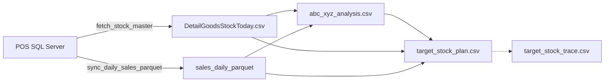
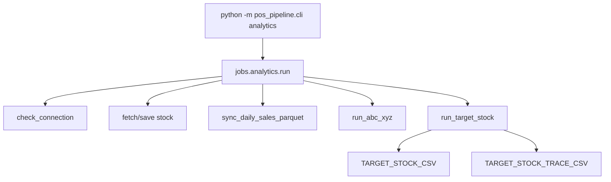
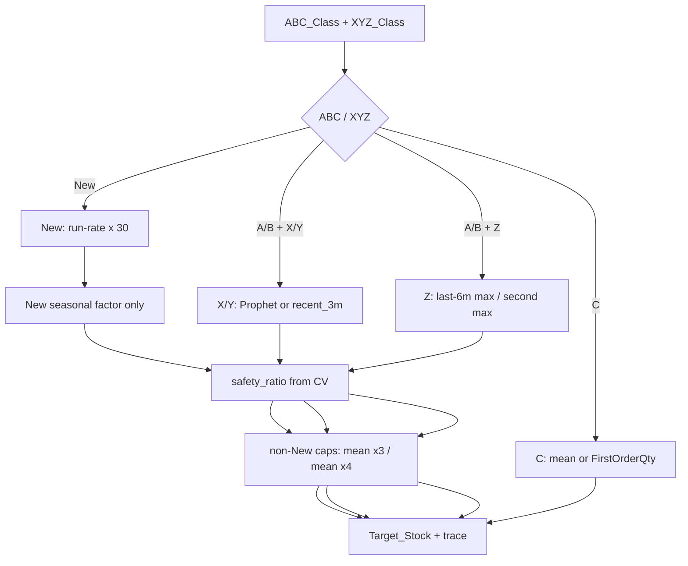

# Analytics Pipeline（v3）

半月分析與目標庫存規劃的規格文件。實作入口是 `python -m pos_pipeline.cli analytics`，程式碼在 `src/pos_pipeline/`。

v3 套件是目前唯一受支援的分析實作。詳細規則見本文件；操作步驟見 [`使用說明.md`](使用說明.md)，舊版規則差異見 [`補貨預測模組拆分與新流程.md`](補貨預測模組拆分與新流程.md)。

---

## 1. 目的與排程

- 頻率：約每兩週一次（本機或未來 Cloud Run Analytics Job）
- 輸入：POS 庫存主檔 + 本機銷售 Parquet 快取
- 輸出：
  - `data/insights/abc_xyz_analysis.csv`
  - `data/insights/target_stock_plan.csv`（下游精簡欄位）
  - `data/insights/target_stock_trace.csv`（計算追蹤）
- Sales 原始明細不上雲；目前 analytics **尚未**上傳 Firestore（daily job 另責）

---

## 2. Data Flow



資料語意重點：

- 只使用**完整日曆月**；月中執行時，當月不納入分析截止月
- 每個 SKU 從**首賣月**起算；首賣後無交易補 `0`；首賣前不補
- ETL 缺資料 ≠ 零需求；目前沒有歷史缺貨狀態，缺貨偏誤列為已知限制

---

## 3. Program Flow



失敗政策：

- 任一步驟例外 → job 回傳 `1`
- Target Stock 先在記憶體算完全部 SKU；每個 CSV 均透過暫存檔個別原子覆寫
- 模型／資料失敗時**不覆寫**上一份成功的 plan／trace
- 不把失敗偷偷改成月均或 `0`

環境變數：

| 變數 | 預設 | 說明 |
|------|------|------|
| `FORECAST_BACKEND` | `prophet` | `prophet` / `neuralprophet` / `recent_3m` |

正式排程建議使用 Prophet；NeuralProphet 僅實驗環境（見 `requirements-neuralprophet.txt`）。

---

## 4. 單一 SKU 計算流程



### 分流摘要

| 類型 | Base Demand | 季節 | 安全庫存 | 上限 |
|------|-------------|------|----------|------|
| New | 日均 × 30；活躍天 `<7` 則 ≤ 總銷 × 3；分母到同步日 | 類別完整月 ≥ 24 才套用，係數夾在 0.8～1.2 | CV 缺失則 0 | 不套 mean×N |
| A/B + X/Y | 完整月 ≥ 24 且有銷售月 ≥ 12 → 模型；否則近 3 完整月平均 | 不套 | A≤0.5、B≤0.3；缺 CV 失敗 | base≤mean×3；target≤max(mean×4, 2) |
| A/B + Z | 近 6 完整月高點；至少 2 個非零月才允許改次高 | 不套 | 同上 | 同上 |
| C | `Mean_Monthly_Qty`；或 Note 單數字 FirstOrderQty | 不套 | 不套 | FirstOrderQty > mean×12 則退回 mean×1.2 |
| Excluded | 不進計畫 | — | — | — |

### FirstOrderQty（Note）

- 恰好一個完整正整數 → 使用
- 沒有或兩個以上 → 缺值，不猜測
- 已知風險：`2024 新款` 會把 `2024` 當首單量；靠 mean×12 與人工覆核保護

---

## 5. 模組地圖

| 模組 | 職責 |
|------|------|
| `analysis/monthly_series.py` | 完整截止月、補 0、近 N 月 |
| `analysis/abc.py` / `xyz.py` / `abc_xyz.py` | 利潤 ABC、需求波動 XYZ、策略標籤 |
| `analysis/demand.py` | New / 近三月 / Z / 季節 / FirstOrderQty |
| `analysis/forecasting.py` | Prophet / NeuralProphet / recent_3m |
| `analysis/target_stock.py` | 分流、安全庫存、防爆、plan+trace、個別 CSV 原子寫檔 |
| `jobs/analytics.py` | 半月編排與錯誤回傳 |

---

## 6. 輸出欄位契約

### `target_stock_plan.csv`（精簡）

`ProductCode`, `Name`, `ABC_XYZ`, `Strategy`, `CurrStock`, `FirstOrderQty`, `Note`, `Base_Demand`, `Final_Demand`, `Target_Stock`

### `target_stock_trace.csv`（追蹤）

另含：`GoodsID`, `Calendar_Start/End`, `Complete_Months`, `Nonzero_Months`, `Forecast_Method`, `Forecast_Status`, `Decision_Source`, `CV`, `CV_Status`, `Seasonal_Factor`, `Safety_Ratio`, `Target_Before_Cap`, `Target_Cap`, `Cap_Applied`, `FirstOrderQty_Parse_Status`

讀表時：若 C 類 `Base/Final=10` 但 `Target=24`，代表決策來源是 FirstOrderQty，不是預測算錯。

---

## 7. 執行方式

### 正式（需 SQL）

```powershell
pip install -r requirements.txt
pip install -e .
pip install -r requirements-forecast.txt   # X/Y Prophet
python -m pos_pipeline.cli analytics
```

### 離線驗證（無 SQL）

```powershell
python -m unittest tests.test_analytics_job.OfflineAnalyticsPipelineTests -v
```

使用 `sample_data/` + `RecentMeanBackend`，不需 Prophet。

### 測試

```powershell
python -m unittest discover -s tests -v
```

---

## 8. 已知限制

- 無法分辨「沒人買」與「缺貨導致沒賣出」
- Note 單數字政策可能把年份誤當首單量
- 尚未宣稱 Prophet／NeuralProphet 準確度；需 walk-forward 回測後才能比較
- Analytics 結果尚未寫入 Firestore
- 雲端 Analytics Job／Cloud Storage Parquet 僅規劃中，見路線圖

---

## 9. 相關文件

| 文件 | 用途 |
|------|------|
| [`REFACTOR_V3_ROADMAP.md`](REFACTOR_V3_ROADMAP.md) | v3 進度 |
| [`使用說明.md`](使用說明.md) | 操作手冊 |
| [`專案心路歷程與架構決策.md`](專案心路歷程與架構決策.md) | 為什麼這樣設計 |
| [`補貨預測模組拆分與新流程.md`](補貨預測模組拆分與新流程.md) | 舊兩段式腳本對照（已標註由 v3 取代執行入口） |
